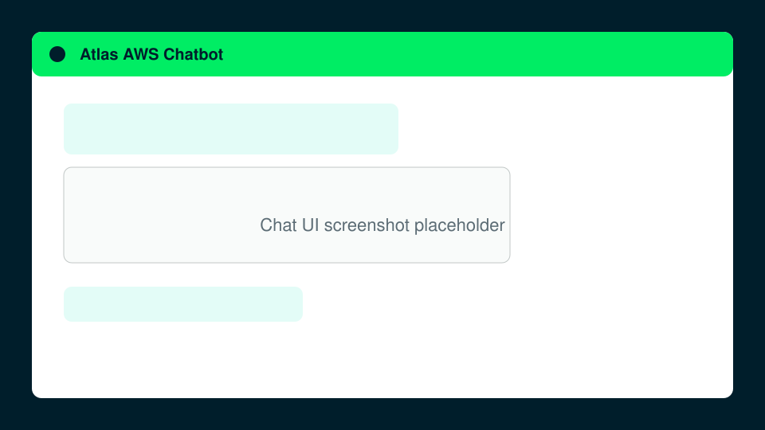

# Atlas AWS Chatbot Terraform Module

This repository holds an example pattern module that deploys the hybrid search chatbot on AWS with MongoDB Atlas.

> This module is an example of a production-shaped deployment. It carries no stability guarantee and the repository may be archived if adoption does not materialize.



<!-- BEGIN_TOC -->
<!-- @generated
WARNING: This section is auto-generated. Do not edit directly.
Changes will be overwritten when documentation is regenerated.
Run 'just gen-readme' to regenerate. -->
- [Examples](#examples)
- [Quickstart](#quickstart)
- [Customize](#customize)
- [Architecture](#architecture)
- [Security and IAM](#security-and-iam)
- [FAQ](#faq)
- [Requirements](#requirements)
- [Providers](#providers)
- [Resources](#resources)
- [Required Variables](#required-variables)
- [Deployment Variables](#deployment-variables)
- [Chatbot](#chatbot)
- [Content Variables](#content-variables)
- [Overrides](#overrides)
- [Outputs](#outputs)
<!-- END_TOC -->

<!-- BEGIN_TABLES -->
<!-- @generated
WARNING: This section is auto-generated. Do not edit directly.
Changes will be overwritten when documentation is regenerated.
Run 'just gen-readme' to regenerate. -->
## Examples

Feature | Name
--- | ---
Chatbot | [Minimal deployment](./examples/minimal)

<!-- END_TABLES -->

## Quickstart

One `terraform apply` deploys everything: the Atlas project and cluster, the AWS infrastructure, the app image, and the running service. The build runs in CodeBuild and pushes to ECR, and the service creates its search indexes and ingests the bundled corpus on startup.

Prerequisites:

- [Terraform](https://developer.hashicorp.com/terraform/install) 1.10 or later.
- An AWS account and credentials for the account you deploy into.
- MongoDB Atlas credentials with access to your organization, because the module creates the project. See [Security and IAM](#security-and-iam).

```sh
terraform init
terraform apply
# open the CloudFront URL and sign in as `demo`
terraform output https_url
terraform output -raw chatbot_login_password
```

Set `features.verify_deployment_ready = true` to have the apply poll `/health` until the app is ready. The apply exports `https_url`, `chatbot`, `chatbot_login_password`, `connection_string_public`, and `extra_apps`. The [minimal example](./examples/minimal) is the copy-paste starting point.

The demo signs in with a single shared username and password: `demo` and the `chatbot_login_password` output. It is meant for a walkthrough. A real application would use its own authentication and authorization, for example an SSO provider, per-user accounts, and role-based access.

## Customize

The three content inputs cover the common path: `queries` sets the starter questions, `document_dirs` sets the documents the app ingests, and `assets_dir` replaces the branding. Empty values keep the bundled demo content.

The named internals and the bring-your-own mechanisms are reached through `overrides`: the VPC (`overrides.byo_vpc`), the cluster shape (`overrides.cluster`), the custom domain (`overrides.domain`), the debug IP (`overrides.allowed_ip`), the extra apps (`overrides.extra_apps`), and the edge (`overrides.networking`). See the input reference below for every field, and [docs/make-it-your-own.md](docs/make-it-your-own.md) for the workflows the examples do not cover.

## Architecture

The module composes the published Landing Zone modules with the app modules in this repository. One apply creates an Atlas project and cluster, a VPC with private networking, an ECS Fargate service behind CloudFront, and a CodeBuild image pipeline. See [docs/architecture.md](docs/architecture.md) for the request flow and the full resource list.

## Security and IAM

The app runs in private subnets with no public IP, reaches Atlas over PrivateLink, and reaches AWS APIs over interface VPC endpoints. The deployer identity is separate from the runtime roles the module creates. See [docs/security-and-iam.md](docs/security-and-iam.md) for the deployer permissions, the Atlas credential requirement, and the roles the module creates.

## FAQ

### What authentication does the demo use?

A single shared username and password: `demo` and the `chatbot_login_password` output. The demo has no per-user accounts and no role model. A real application would put its own authentication and authorization in front of the app, for example an SSO provider, per-user accounts, and role-based access, and would not reuse the demo login.

### How much does this cost?

The stack bills while it is up. The inputs that move the bill are:

- `features.waf`: the AWS Managed Rules Common Rule Set on CloudFront.
- `features.vpc_endpoints`: the interface VPC endpoints, billed per AZ-hour.
- `features.internet_egress`: a NAT gateway, billed hourly plus data.
- `features.atlas_byok`: a customer-managed KMS key.
- `features.atlas_s3_log_export` and `features.atlas_s3_backup_export`: the export S3 buckets.
- `overrides.cluster`: the cluster type, shard count, and instance size.
- `overrides.extra_apps`: each app adds Fargate compute and an ECR repository.
- `overrides.byo_vpc`: your own VPC resources, billed by your account.
- `overrides.networking.main.waf_disabled`: skip the WAF on the edge.

The Atlas cluster, the load balancer, CloudFront, ECS Fargate, ECR, and Secrets Manager bill by default. Run `terraform destroy` when you are done.

### What is the file upload size limit?

The upload picker accepts PDF, txt, and md files, up to 20 files and 100 MB per batch.

### How does the LLM answer work?

The default provider is Amazon Bedrock. The ECS task role calls `bedrock-runtime` over a private interface endpoint, so there is no API key and no manual approval step.

For a keyed provider, run `just create-llm-secret` to write the API key to Secrets Manager, then set `llm.provider` and `llm.secret_name` to the printed name. The recipe supports Anthropic, OpenAI, Gemini, and Grove keys. Grove also needs `llm.base_url`. Run `just delete-llm-secret` to remove the secret.

### How do I use a more advanced Bedrock model?

Set `llm.model` to the model id. A newer Amazon model or an Anthropic Claude model needs the `us.` inference-profile prefix, and a Claude model needs a one-time use-case form in the Bedrock console for the account.

### How does ingest and search work?

The app extracts and chunks each document, upserts one document per chunk into `chunks`, and Atlas Automated Embedding embeds each chunk inside the cluster. A question runs `$rankFusion` over a text pipeline and a vector pipeline, and the LLM answers from the top-ranked chunks. See [docs/architecture.md](docs/architecture.md) for the flow.

### Why does search fail with `localhost:28000`?

`$rankFusion` runs `$search` on the cluster, and `mongod` connects to Atlas Search (`mongot`) at `127.0.0.1:28000` on the same node. A connection refused error means `mongot` is not listening. Confirm `chunks.text_idx` and `chunks.autoembed_idx` are `READY` in the index status, and recreate them if they were never created.

### What is the app secret name?

`<app_name>-app`. For the minimal example that is `mongodb-chatbot-demo-app`.

### What region does this example use?

`regions[0]` (default `us-east-1`). The app runs in the first region.

### How do I use a custom domain?

Set `overrides.domain.aliases` and `overrides.domain.acm_certificate_arn`. The certificate must be in `us-east-1`.

### How do I use my own VPC?

Set `overrides.byo_vpc` with one entry per region. CloudFront reaches the internal load balancer through a VPC origin, which requires an internet gateway in the VPC, so a BYO VPC that serves the HTTP edge must already have one.

### How do I add another app or a private worker?

Set `overrides.extra_apps`. An entry with `routing` joins the shared edge. An entry with no `routing` is a private worker with no HTTP edge.

### How do I debug with mongosh?

Set `features.debug_access_for_cluster = true` to add the caller IP to the project access list and create a `debug` database user. Read the connection string from the `connection_string_public` output. Set `overrides.allowed_ip` to use a fixed IP instead of resolving the caller's.

### Where do I find the Landing Zone module inputs?

Full schemas live in the published modules: [project](https://registry.terraform.io/modules/terraform-mongodbatlas-modules/project/mongodbatlas/latest), [cluster](https://registry.terraform.io/modules/terraform-mongodbatlas-modules/cluster/mongodbatlas/latest), and [atlas-aws](https://registry.terraform.io/modules/terraform-mongodbatlas-modules/atlas-aws/mongodbatlas/latest).

<!-- BEGIN_TF_DOCS -->
<!-- @generated
WARNING: This section is auto-generated by terraform-docs. Do not edit directly.
Changes will be overwritten when documentation is regenerated.
Run 'just docs' to regenerate.
-->
## Requirements

The following requirements are needed by this module:

- <a name="requirement_terraform"></a> [terraform](https://developer.hashicorp.com/terraform/install) (>= 1.10)

- <a name="requirement_archive"></a> [archive](https://registry.terraform.io/providers/hashicorp/archive/latest/docs) (~> 2.7)

- <a name="requirement_aws"></a> [aws](https://registry.terraform.io/providers/hashicorp/aws/latest/docs) (~> 6.0)

- <a name="requirement_http"></a> [http](https://registry.terraform.io/providers/hashicorp/http/latest/docs) (~> 3.4)

- <a name="requirement_mongodbatlas"></a> [mongodbatlas](https://registry.terraform.io/providers/mongodb/mongodbatlas/latest/docs) (~> 2.16)

- <a name="requirement_random"></a> [random](https://registry.terraform.io/providers/hashicorp/random/latest/docs) (~> 3.6)

- <a name="requirement_time"></a> [time](https://registry.terraform.io/providers/hashicorp/time/latest/docs) (~> 0.13)

## Providers

The following providers are used by this module:

- <a name="provider_archive"></a> [archive](https://registry.terraform.io/providers/hashicorp/archive/latest/docs) (~> 2.7)

- <a name="provider_aws"></a> [aws](https://registry.terraform.io/providers/hashicorp/aws/latest/docs) (~> 6.0)

- <a name="provider_http"></a> [http](https://registry.terraform.io/providers/hashicorp/http/latest/docs) (~> 3.4)

- <a name="provider_mongodbatlas"></a> [mongodbatlas](https://registry.terraform.io/providers/mongodb/mongodbatlas/latest/docs) (~> 2.16)

- <a name="provider_random"></a> [random](https://registry.terraform.io/providers/hashicorp/random/latest/docs) (~> 3.6)

- <a name="provider_terraform"></a> [terraform](https://developer.hashicorp.com/terraform/language/resources/terraform-data)

- <a name="provider_time"></a> [time](https://registry.terraform.io/providers/hashicorp/time/latest/docs) (~> 0.13)

## Resources

The following resources are used by this module:

- [aws_codebuild_project.image](https://registry.terraform.io/providers/hashicorp/aws/latest/docs/resources/codebuild_project) (resource)
- [aws_iam_role.codebuild](https://registry.terraform.io/providers/hashicorp/aws/latest/docs/resources/iam_role) (resource)
- [aws_iam_role_policy.codebuild](https://registry.terraform.io/providers/hashicorp/aws/latest/docs/resources/iam_role_policy) (resource)
- [aws_s3_bucket.source](https://registry.terraform.io/providers/hashicorp/aws/latest/docs/resources/s3_bucket) (resource)
- [aws_s3_object.app](https://registry.terraform.io/providers/hashicorp/aws/latest/docs/resources/s3_object) (resource)
- [aws_s3_object.assets](https://registry.terraform.io/providers/hashicorp/aws/latest/docs/resources/s3_object) (resource)
- [aws_secretsmanager_secret.app](https://registry.terraform.io/providers/hashicorp/aws/latest/docs/resources/secretsmanager_secret) (resource)
- [aws_secretsmanager_secret_version.app](https://registry.terraform.io/providers/hashicorp/aws/latest/docs/resources/secretsmanager_secret_version) (resource)
- [aws_security_group_rule.atlas_pl_ingress_from_app](https://registry.terraform.io/providers/hashicorp/aws/latest/docs/resources/security_group_rule) (resource)
- [mongodbatlas_database_user.ecs](https://registry.terraform.io/providers/mongodb/mongodbatlas/latest/docs/resources/database_user) (resource)
- [mongodbatlas_database_user.public_debug](https://registry.terraform.io/providers/mongodb/mongodbatlas/latest/docs/resources/database_user) (resource)
- [random_password.chatbot_auth](https://registry.terraform.io/providers/hashicorp/random/latest/docs/resources/password) (resource)
- [random_password.chatbot_demo_password](https://registry.terraform.io/providers/hashicorp/random/latest/docs/resources/password) (resource)
- [random_password.public_debug](https://registry.terraform.io/providers/hashicorp/random/latest/docs/resources/password) (resource)
- [terraform_data.build](https://developer.hashicorp.com/terraform/language/resources/terraform-data) (resource)
- [terraform_data.prepare_build_dirs](https://developer.hashicorp.com/terraform/language/resources/terraform-data) (resource)
- [terraform_data.render_assets](https://developer.hashicorp.com/terraform/language/resources/terraform-data) (resource)
- [terraform_data.verify](https://developer.hashicorp.com/terraform/language/resources/terraform-data) (resource)
- [time_sleep.iam_propagation](https://registry.terraform.io/providers/hashicorp/time/latest/docs/resources/sleep) (resource)
- [archive_file.app](https://registry.terraform.io/providers/hashicorp/archive/latest/docs/data-sources/file) (data source)
- [archive_file.assets](https://registry.terraform.io/providers/hashicorp/archive/latest/docs/data-sources/file) (data source)
- [aws_caller_identity.current](https://registry.terraform.io/providers/hashicorp/aws/latest/docs/data-sources/caller_identity) (data source)
- [aws_iam_policy_document.codebuild](https://registry.terraform.io/providers/hashicorp/aws/latest/docs/data-sources/iam_policy_document) (data source)
- [aws_iam_policy_document.codebuild_assume](https://registry.terraform.io/providers/hashicorp/aws/latest/docs/data-sources/iam_policy_document) (data source)
- [aws_secretsmanager_secret_version.llm](https://registry.terraform.io/providers/hashicorp/aws/latest/docs/data-sources/secretsmanager_secret_version) (data source)
- [http_http.caller_ip](https://registry.terraform.io/providers/hashicorp/http/latest/docs/data-sources/http) (data source)
- [mongodbatlas_roles_org_id.current](https://registry.terraform.io/providers/mongodb/mongodbatlas/latest/docs/data-sources/roles_org_id) (data source)

<!-- BEGIN_TF_INPUTS_RAW -->
<!-- @generated
WARNING: This grouped inputs section is auto-generated. Do not edit directly.
Changes will be overwritten when documentation is regenerated.
Run 'just docs' to regenerate.
-->
## Required Variables

### app_name

Name for the Atlas project, the AWS resources, and the app image. Lowercase letters, digits, and hyphens; 1 to 23 characters so the Atlas cluster name is not truncated.

Type: `string`


## Deployment Variables

### regions

Atlas cluster regions. Use AWS region names (for example us-east-1); the Atlas form (US_EAST_1) is also accepted. The app runs in the first region.

Type:

```hcl
list(object({
  name       = string
  node_count = optional(number, 3)
}))
```

Default:

```json
[
  {
    "name": "us-east-1",
    "node_count": 3
  }
]
```

### features

Opt-in deployment features. The defaults produce a private, tagged demo:

- `waf`: attach the AWS Managed Rules Common Rule Set to the CloudFront distribution.
- `vpc_endpoints`: keep the interface VPC endpoints (ECR, logs, Secrets Manager, STS) in the VPC. Set false to skip them; the app then reaches AWS APIs over NAT, which the module enables.
- `internet_egress`: allow HTTPS egress from the app security group through NAT.
- `atlas_byok`: create a customer-managed KMS key and enable Atlas encryption at rest with it.
- `atlas_s3_log_export`: export Atlas logs to a module-managed S3 bucket.
- `atlas_s3_backup_export`: export Atlas backups to a module-managed S3 bucket.
- `debug_access_for_cluster`: add a caller IP to the project access list and create a database user that borrows the first app's role and database, but intentionally widens collection-scoped access to the database level for debugging. With no apps, it falls back to `readWrite` on `hybrid_search`.
- `verify_deployment_ready`: poll `/health` from the apply and fail on a timeout.

Type:

```hcl
object({
  waf                      = optional(bool, true)
  vpc_endpoints            = optional(bool, true)
  internet_egress          = optional(bool, false)
  atlas_byok               = optional(bool, false)
  atlas_s3_log_export      = optional(bool, false)
  atlas_s3_backup_export   = optional(bool, false)
  debug_access_for_cluster = optional(bool, false)
  verify_deployment_ready  = optional(bool, false)
})
```

Default: `{}`

### llm

LLM provider for the app. Defaults to Amazon Bedrock, which uses the ECS task role and needs no key. Set `secret_name` for a keyed provider; the provider is inferred from the name unless set explicitly. Grove also requires `base_url`.

Type:

```hcl
object({
  provider    = optional(string, "bedrock")
  model       = optional(string)
  secret_name = optional(string)
  base_url    = optional(string)
})
```

Default: `{}`

### extra_tags

Additional tags merged over the module's built-in `Example` and `Name` tags. Set `overrides.skip_tags = true` to set no tags at all.

Type: `map(string)`

Default: `{}`


## Chatbot

### chatbot

The vendored chat app. Enabled by default; every field defaults to the demo.

- `enabled`: deploy the chatbot. Set false to deploy only `overrides.extra_apps`.
- `image_url` / `dockerfile_path`: bring your own image, or build your own Dockerfile instead of the vendored app. Mutually exclusive.
- `ecr`: null infers from the image source. Built apps keep a module-managed ECR repository; a pure `image_url` app skips it. Set true with `image_url` to keep the repository around during a rollback or cutover.
- `container_size`: `small`, `medium`, or `large`; maps to the ECS task CPU and memory.
- `task_cpu` / `task_memory`: exact ECS units, overriding `container_size`.
- `system_prompt`: the RAG system prompt the app answers with. Null keeps the app default, which answers with short bullet points first and a paragraph of details after.
- `db_access`: the database and role the app authenticates as.
- `routing`: the path pattern and listener priority on the shared edge. Defaults to `/*` at priority 100.
- `internet_egress`: allow HTTPS egress from the app security group through NAT.
- `aws_region`: the app's AWS region. Defaults to the first entry in `regions`.

Type:

```hcl
object({
  enabled         = optional(bool, true)
  image_url       = optional(string)
  dockerfile_path = optional(string)
  ecr             = optional(bool)
  container_size  = optional(string, "small")
  task_cpu        = optional(string)
  task_memory     = optional(string)
  system_prompt   = optional(string)
  db_access = optional(object({
    database_name   = optional(string, "hybrid_search")
    role_name       = optional(string, "readWrite")
    collection_name = optional(string)
  }), {})
  routing = optional(object({
    path_pattern      = optional(list(string), ["/*"])
    host_header       = optional(list(string), [])
    listener_priority = optional(number, 100)
    container_port    = optional(number, 8001)
    }), {
    path_pattern      = ["/*"]
    host_header       = []
    listener_priority = 100
    container_port    = 8001
  })
  internet_egress = optional(bool, false)
  aws_region      = optional(string)
})
```

Default: `{}`


## Content Variables

### queries

Example questions rendered to `assets/demo_queries.yaml`, in list order. Each entry sets the `label` shown in the UI and the `message` it sends. Empty keeps the app's bundled file.

Type:

```hcl
list(object({
  label   = string
  message = string
}))
```

Default: `[]`

### document_dirs

Documents copied into the image under `assets/document_dirs/`. Empty keeps the bundled corpus; a non-empty list replaces it. The bundled corpus is assembled from the repository docs unless `skip_repo_docs` is true. Each entry resolves one of three ways:

- A bare name (no slash) resolves to the bundled corpus, for example `why-mongodb-for-agents.md`.
- A path with a slash resolves relative to the working directory, for example `./docs/handbook/`.
- An absolute path is used as-is.

Type: `list(string)`

Default: `[]`

### skip_repo_docs

Do not stage the repository docs into the bundled corpus. Set true to start with an empty corpus. A bare `document_dirs` name then fails validation, and only a path or absolute entry works.

Type: `bool`

Default: `false`

### assets_dir

Directory mirroring the app's `assets/` tree, copied over the rendered defaults. The branding mechanism: replace `.chainlit/config.toml`, `chainlit.md`, and `public/` without a per-file input.

Type: `string`

Default: `null`


## Overrides

### overrides

The named internals, the bring-your-own mechanisms, and `extra_apps`. Empty by default.

- `byo_vpc`: a per-region map that replaces the managed VPC (`vpc_config.create = false`).
- `cluster`: `cluster_type`, `shard_count`, `manual_scaling`, `auto_scaling.min_instance_size`, and `autoembed_model`.
- `extra_apps`: a map of additional apps on the same cluster. Each entry supports `image_url` or `dockerfile_path`, nullable `ecr`, `container_size`, `db_access`, and `routing`. An entry with no `routing` is a private worker with no HTTP edge.
- `networking`: the shared `main` edge every routing app uses.
- `domain`: the custom-domain aliases and ACM certificate.
- `allowed_ip`: a fixed debug IP instead of resolving the caller's.
- `skip_tags`: set no tags at all.

Type:

```hcl
object({
  byo_vpc = optional(map(object({
    vpc_id                  = string
    private_subnet_ids      = list(string)
    public_subnet_ids       = optional(list(string), [])
    vpc_cidr_block          = string
    private_route_table_ids = list(string)
  })))

  cluster = optional(object({
    cluster_type = optional(string, "SHARDED")
    shard_count  = optional(number, 1)
    manual_scaling = optional(object({
      instance_size = string
    }))
    auto_scaling = optional(object({
      min_instance_size = optional(string, "M30")
    }), {})
    autoembed_model = optional(string, "voyage-4-lite")
  }), {})

  extra_apps = optional(map(object({
    image_url       = optional(string)
    dockerfile_path = optional(string)
    ecr             = optional(bool)
    container_size  = optional(string, "small")
    task_cpu        = optional(string)
    task_memory     = optional(string)
    db_access = optional(object({
      database_name   = optional(string, "hybrid_search")
      role_name       = optional(string, "readWrite")
      collection_name = optional(string)
    }), {})
    # No default: an omitted or null routing is a private worker with no
    # listener rule. A `/*` default would collide with the chatbot's rule.
    routing = optional(object({
      path_pattern      = optional(list(string), ["/*"])
      host_header       = optional(list(string), [])
      listener_priority = optional(number, 100)
      container_port    = optional(number, 8001)
    }))
    internet_egress = optional(bool, false)
    aws_region      = optional(string)
  })), {})

  networking = optional(object({
    main = optional(object({
      waf_disabled = optional(bool, false)
    }), {})
  }), {})

  domain = optional(object({
    aliases             = optional(list(string))
    acm_certificate_arn = optional(string)
  }))

  allowed_ip = optional(string, "")
  skip_tags  = optional(bool, false)
})
```

Default: `{}`

<!-- END_TF_INPUTS_RAW -->

## Outputs

The following outputs are exported:

### <a name="output_chatbot"></a> [chatbot](#output\_chatbot)

Description: The chat app's image, login, secret, database access, IAM task role, ECS service, log group, target group, and build result. Null when chatbot.enabled is false.

### <a name="output_chatbot_login_password"></a> [chatbot\_login\_password](#output\_chatbot\_login\_password)

Description: Demo login password (also in the app secret). Null when chatbot.enabled is false.

### <a name="output_connection_string_public"></a> [connection\_string\_public](#output\_connection\_string\_public)

Description: Public connection string for the debug database user, for mongosh or a local app. Null when features.debug\_access\_for\_cluster is false.

### <a name="output_extra_apps"></a> [extra\_apps](#output\_extra\_apps)

Description: Per-app path, image, secret, database access, IAM task role, ECS service, log group, target group, and build result for overrides.extra\_apps.

### <a name="output_https_url"></a> [https\_url](#output\_https\_url)

Description: CloudFront HTTPS URL for the HTTP edge. Null when no app routes.
<!-- END_TF_DOCS -->
