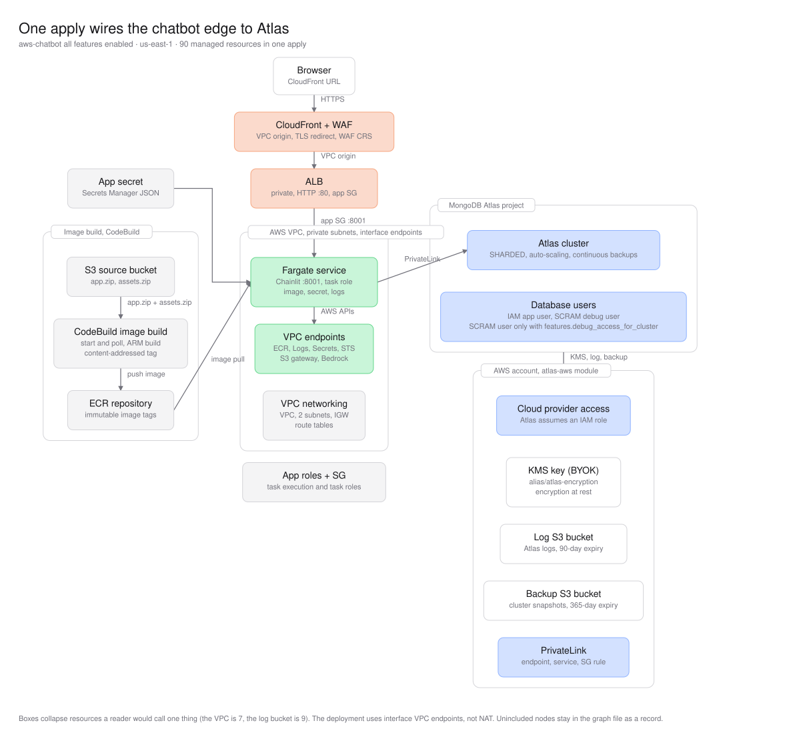
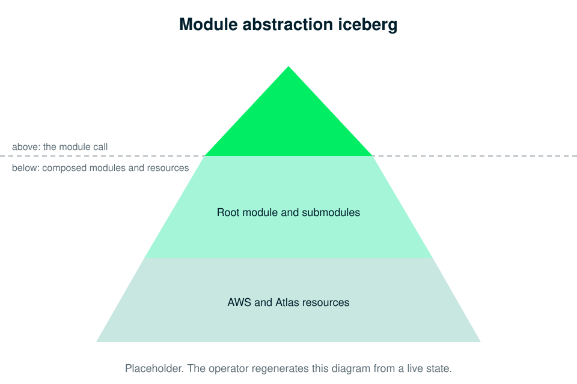

# Architecture

This guide describes what the module deploys and how a request flows through it. It is also one of the documents the deployed chatbot ingests, so the chat can answer questions about its own deployment.

## What the module deploys

One `terraform apply` creates the Atlas project, the cluster, the AWS app infrastructure, the app image, and the running service. The module composes the published Landing Zone modules ([project](https://registry.terraform.io/modules/terraform-mongodbatlas-modules/project/mongodbatlas/latest), [atlas-aws](https://registry.terraform.io/modules/terraform-mongodbatlas-modules/atlas-aws/mongodbatlas/latest), [cluster](https://registry.terraform.io/modules/terraform-mongodbatlas-modules/cluster/mongodbatlas/latest)) with the app modules that live in this repository.

The apply creates the following resources, grouped by ownership.

- **Atlas**
  - A project.
  - A sharded cluster with compute and disk auto-scaling.
  - A PrivateLink endpoint per cluster region, so the app reaches the cluster over private networking.
  - One IAM database user per app. The username is the ECS task role ARN, so the container authenticates with `MONGODB-AWS` and holds no database password.
  - Optional customer-managed KMS encryption at rest, log export, and backup export to module-managed S3 buckets.
  - Optional debug database user, used with a local `mongosh` or a local app.
- **AWS app infrastructure** (the `modules/app-infra` submodule)
  - A VPC with private subnets, an internet gateway for the CloudFront VPC origin, and interface VPC endpoints. A NAT gateway is added only when the caller enables internet egress or skips the interface endpoints.
  - Interface VPC endpoints for ECR, CloudWatch Logs, Secrets Manager, and STS, plus the S3 gateway endpoint.
  - An ECR repository per built app.
  - An internal Application Load Balancer behind a CloudFront distribution, with the AWS Managed Rules Common Rule Set attached to the distribution.
  - An ECS cluster and a Fargate service (the `modules/ecs-service` submodule).
  - Task and execution roles, and app security groups.
- **Image build**
  - An S3 source bucket, a CodeBuild project, and a CodeBuild IAM role.
  - The build pushes the image to ECR. The image tag is content-addressed from the app tree and the rendered assets tree, so a change to either starts one build.
- **Secrets**
  - One Secrets Manager app secret per app, named `<app_name>-app`. The secret holds the container environment, the login credentials, and any LLM key.
- **LLM**
  - With the default Amazon Bedrock provider, a `bedrock-runtime` interface endpoint and a task-role policy scoped to the Converse actions.
  - With a keyed provider, a secret that carries the API key.

## How a request flows

The app ingests documents, embeds them inside Atlas, and answers questions with hybrid search. The app never calls an embedding API and never stores a vector.

- **Ingest:** the app extracts text from each document, splits it into chunks, and upserts one document per chunk into the `chunks` collection with the `content`, the source path, and the chunk index.
- **Embed:** an Atlas Automated Embedding index (`autoembed_idx`) points at the `content` field. Atlas embeds each chunk inside the cluster at index time.
- **Search:** a question is sent as plain text. Atlas embeds the query text, then `$rankFusion` runs a text pipeline (`text_idx`) and a vector pipeline (`autoembed_idx`) over the same collection and combines the ranked results.
- **Answer:** the highest-ranked chunks are passed to the LLM, which answers from those chunks and lists the source filenames.

## Startup, indexes, and health

The service creates the search indexes and ingests the bundled corpus in a background task on startup. The chat UI is reachable while that task runs, and the data becomes queryable once ingestion finishes. Only `features.verify_deployment_ready` makes the apply wait for it. A chat session also creates missing indexes, so the two paths are idempotent.

The app serves `GET /health` with no authentication. The response reports `indexes_ready`, `data_ingested`, and the status of each index. The Application Load Balancer target group health-checks `/health`, so the endpoint decides whether the task stays in service. With `features.verify_deployment_ready`, the apply polls `/health` and fails on a timeout.
